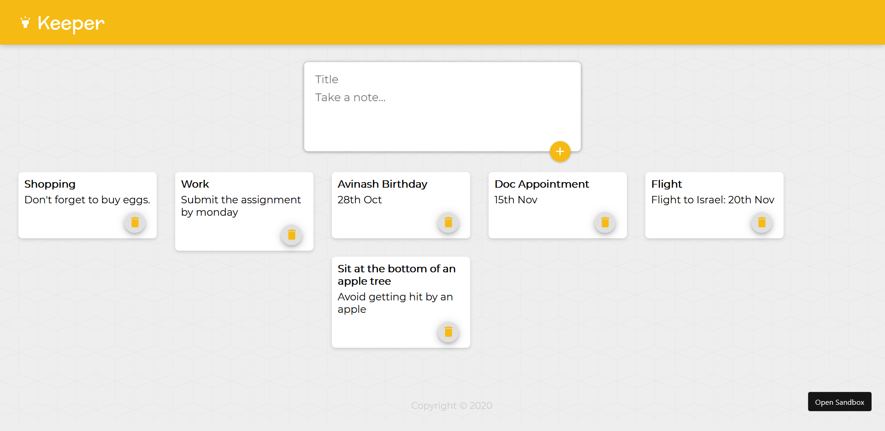

# Keeper App

Keeper App is a note-taking app developed with ReactJs.Keeper App is an app where we can store our daily thoughts, tasks, lists, etc. into a bunch of dynamically rendered small digital white notes. This app has been developed using ReactJS. Through this app I familiarized myself with the fundamentals of ReactJS like working with components, props, working with hooks, with different states, complex states and managing the component tree.

So, in a nutshell I had a lot of fun while working on this project and I got to learn a lot.

## Developed By
> Pankti Shah

## Screenshots


## Live Demo 

 [Keeper App](https://vn8bd.csb.app/)

## Developed using
* Html
* css
* javascript
* ReactJS

## Setup:

#### Clone this repository:

```bash
git clone https://github.com/panktishah62/Keeper-App.git
```
or download the zip file from github.

After extracting the files, 

* 1  .``cd Keeper-App`` 
* 2  .``npm install``
* 3  .``npm start``


## Further help

* To get more help on the Javascript go check out the [MDN Javascript Documentation](https://developer.mozilla.org/en-US/docs/Web/JavaScript).
* To get more help on the React go check out the [Reactjs Documentation](https://reactjs.org/docs/getting-started.html).


